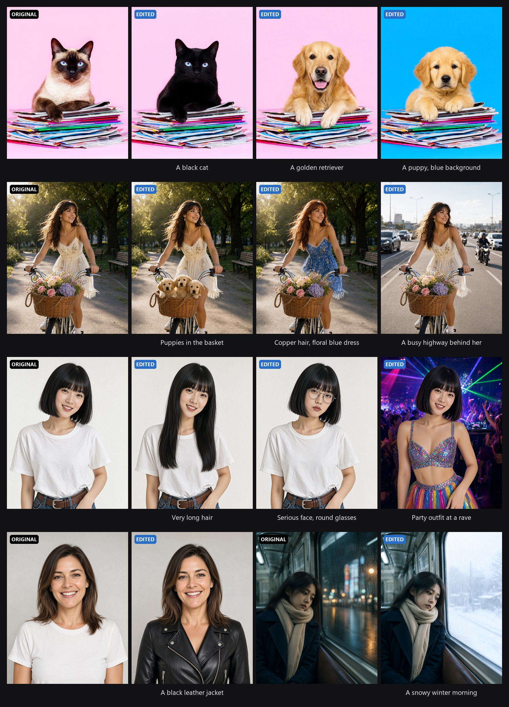
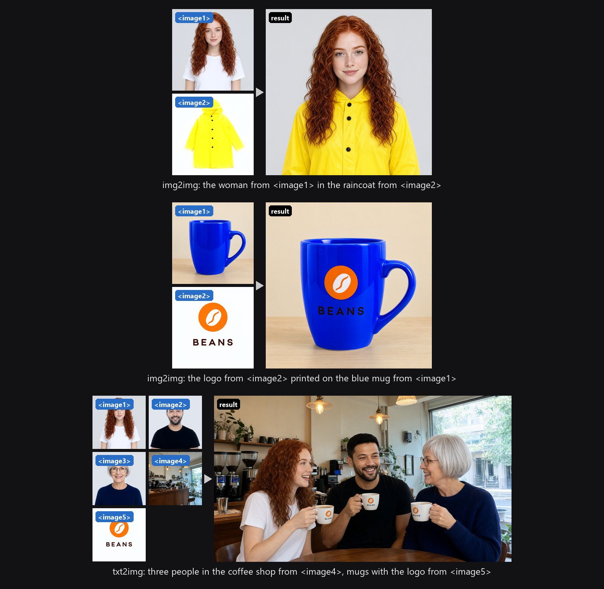
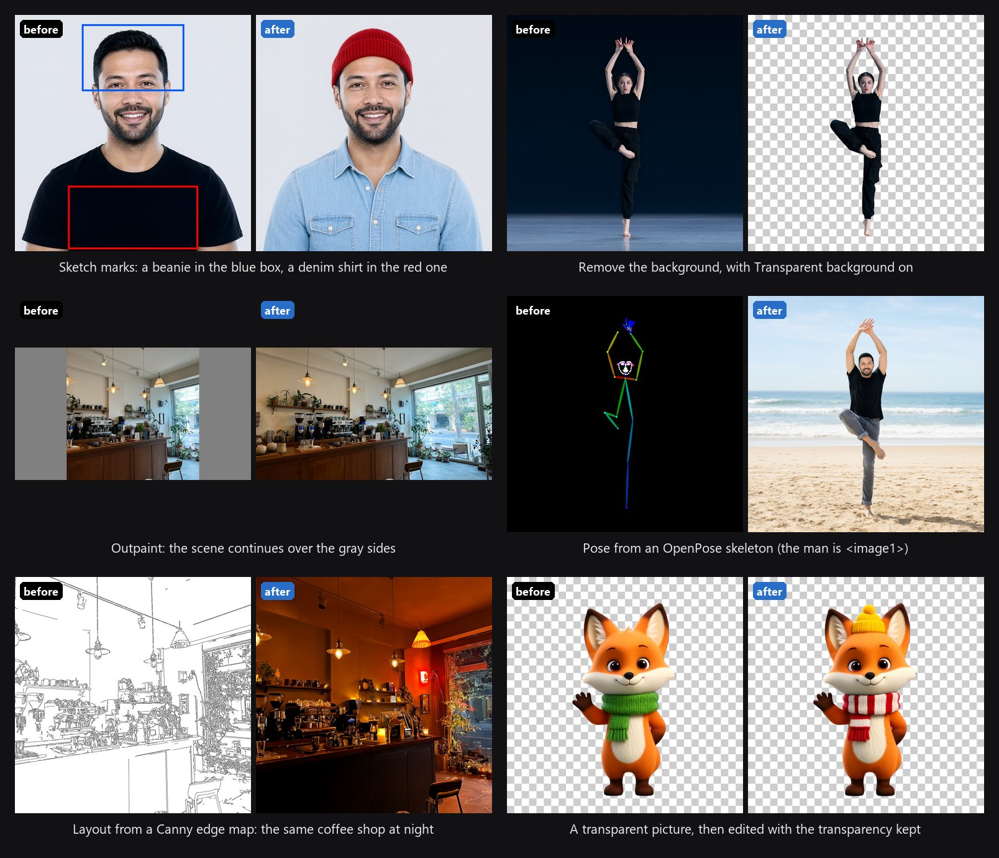
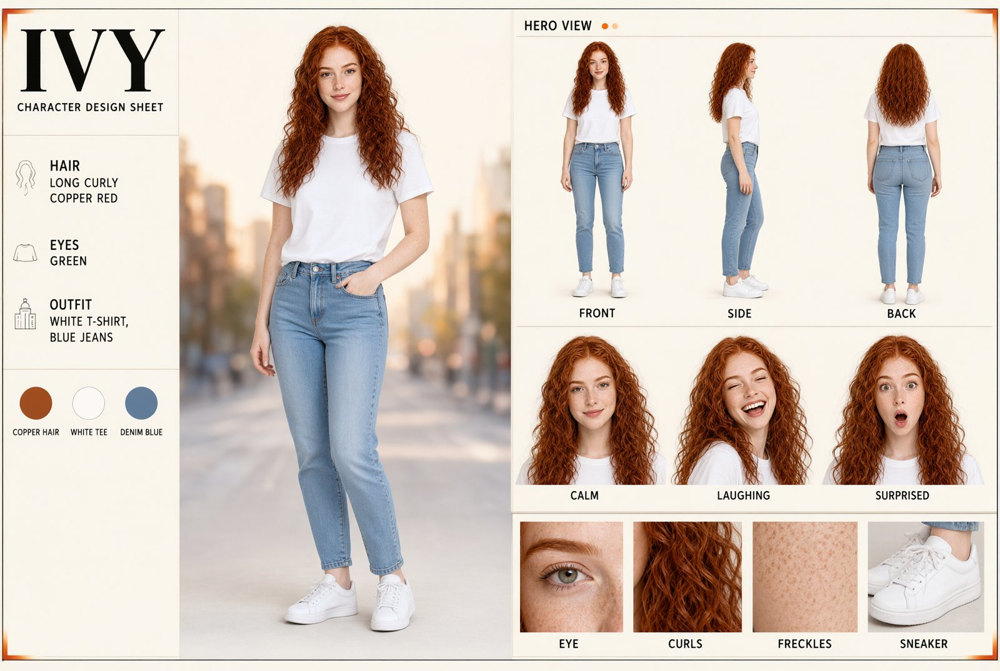

# 🎨 Qwen-Image 2.1 for Forge Neo

<div align="center">

[](https://github.com/Haoming02/sd-webui-forge-classic/tree/neo)
[](https://gradio.app/)
[](https://github.com/eduardoabreu81/qwen2.1-forge-neo)
[](LICENSE)

> **Extension for [Stable Diffusion WebUI Forge - Neo](https://github.com/Haoming02/sd-webui-forge-classic/tree/neo)**

</div>

Generate with **[Qwen-Image 2.1](https://huggingface.co/Qwen/Qwen-Image-2.1)** inside Forge Neo, using the checkpoint, preset and Generate button you already know - sharp text rendering, coherent scenes, image editing, transparent images and fast turbo checkpoints, even on 8 GB GPUs.

> [!Important]
> This extension requires an up-to-date **Forge Neo** (the `neo` branch, updated on or after 30 September 2026). On an older version it stays disabled and tells you so in the console - Forge Neo itself keeps working as usual.

---

## 📋 Table of Contents

- [What's New](#-whats-new)
- [Features](#-features)
- [Installation](#-installation)
- [Recommended Settings](#%EF%B8%8F-recommended-settings)
- [Tips](#-tips)
- [Credits](#-credits)

---

## 🆕 What's New

### v0.1.0 - First Release

- **Qwen-Image 2.1 in Forge Neo** - checkpoint, text encoder and VAE load through the usual **VAE / Text Encoder** selector, including the quantized files made for ComfyUI.
- **qwen21 UI preset** - sampler, schedule, steps and CFG ready for turbo checkpoints.
- **Viggle Turbo schedule** - the steps turbo checkpoints were trained on, for sharp images in 6-8 steps.
- **Transparent background** - one checkbox, and the image is saved as a PNG with real transparency.
- **Remove VAE grid** - cleans the faint dot-and-stripe pattern the Qwen-Image 2.1 VAE leaves on smooth areas.
- **LoRA support** - Qwen-Image 2.1 LoRAs with the usual `<lora:name:weight>` syntax.
- **Image editing** - in img2img, describe the change and the model edits your image, keeping the rest of it.
- **Multiple reference images** - up to 10, from Forge Neo's **ImageStitch Integrated** gallery, numbered on screen as `<image1>`, `<image2>`... for the prompt; in txt2img they make a new picture.

---

## 🎯 Features

> [!Tip]
> Every example below, in full resolution and with its prompt and settings, is in the **[wiki](https://github.com/eduardoabreu81/qwen2.1-forge-neo/wiki)**.

### 🖼️ Native Generation

- Runs inside txt2img - no separate tab, no extra environment
- Works with the Forge Neo model folders and the **VAE / Text Encoder** selector you already use
- Loads quantized checkpoints and text encoders as they are - tested on an 8 GB RTX 2070
- Negative prompt and CFG work as with any other model

### ⚡ Turbo Checkpoints

- **Viggle Turbo** schedule in the **Schedule type** list
- Adapts the steps to the image size automatically
- Works with any step count; 6-8 steps is the sweet spot

### 🎛️ Base Checkpoints

- **Qwen Base** schedule in the **Schedule type** list - the official schedule of the model, for base (non-turbo) checkpoints
- Adapts to the image size automatically

### ✏️ Image Editing

<p align="center"></p>

- **Use the input image as reference** checkbox in the **Qwen-Image 2.1** accordion of img2img
- Write the change as an instruction - *"Change her t-shirt to a black leather jacket"*, *"Replace the background with a city street at sunset"*
- Clothes, colors, hair, objects, characters, backgrounds, weather and time of day
- Keeps the pose, face, light and composition of the parts you did not ask to change
- Works with turbo and base checkpoints, at CFG 1, up to 2048x2048
- The output size can differ from the input's - set a wider size to widen the picture
- Any seed works, including the one that made the input image
- **Reference size**: *1024x1024* (default) or *Same as the output*, which reads the references at the output size - a little more detail at 2K, and slower

### 🧩 Multiple References

<p align="center"></p>

- Add the extra images to the **ImageStitch Integrated** gallery, which Forge Neo already has, and turn its accordion on
- Each thumbnail shows its tag - name them in the prompt by it: *"the woman from `<image1>` in the raincoat from `<image2>`"*
- **img2img** edits the input image, which is `<image1>`; the gallery starts at `<image2>`
- **txt2img** makes a new picture from the gallery alone - people at a table, a character in a place, a logo on a product
- Up to 10 references, the model's limit; each one adds about the work of a 1024x1024 image to every step, so more references mean slower generations and more VRAM

### 🎯 Pose and Layout from a Picture

- Any picture can steer the result, without a ControlNet model: a photo with the pose, an OpenPose skeleton or a Canny edge map
- Make the skeleton or the edge map with Forge's own preprocessors in **ControlNet Integrated** (the preprocessor alone is enough), add it as a reference and name it: *"in exactly the body pose of the OpenPose skeleton in `<image2>`"*, *"following exactly the lines and layout of `<image1>`"*

### 🖍️ More Edits

<p align="center"></p>

- **Sketch marks** - draw a colored box around each thing to change, then say what goes in each box and ask to remove the box outlines
- **Inpaint** - the **Inpaint** tab works with the reference on, including **Only masked**; describe only the change and add *"Keep everything else exactly as it is"*
- **Remove the background** - turn on **Transparent background** and write *"Remove the background, and output a PNG image"*
- **Outpaint** - put the picture on a wider canvas with solid gray sides and ask to *"replace the solid gray areas with a seamless continuation of the scene"*
- **Keep the frame in place** - a change of style can come back slightly bigger or shifted; the **[Consistency LoRA](https://huggingface.co/ausboss/Qwen-Image-2.1-Consistency-LoRA)** (`<lora:qwen-image-2.1-consistency:1>`) keeps the edit on the original's frame - on a watercolor test the edges lined up with the photo more than twice as closely

### 🧍 Character Sheets

<p align="center"></p>

- img2img with the character as `<image1>`, a wide size such as 1376x768 and **Denoising strength** at 1
- Three views from a single picture, even a chest-up portrait - the model draws the rest of the body:

```text
A character sheet of the character from <image1>, full body from head to feet, standing in a relaxed neutral pose, lit brightly and evenly. Three views side by side in one row, all at the same size, from left to right: front view facing the viewer, side view in profile facing right, back view seen from behind. Keep the same face, hairstyle, clothing, colors, proportions and art style as in <image1>.
```

- A full design sheet, like the one above, comes from a longer prompt that lays out each zone - name, palette, hero view, turnaround, expressions, close-ups - at about 3.4 MP; the prompt is in the [wiki](https://github.com/eduardoabreu81/qwen2.1-forge-neo/wiki/Character-Sheets)

### 🧊 Transparent Images

- **Transparent background** checkbox in the **Qwen-Image 2.1** accordion
- Write only the subject - the extension adds the wording the model expects
- Saved as PNG with a real alpha channel; normal images stay exactly as before
- Stray specks the model leaves in the background are cleared; the subject and its soft shadow are kept
- Transparent pictures can be edited too: in img2img, with **Transparent background** and the reference on, the result keeps its transparency

### 🧼 Clean Output

- **Remove VAE grid**, on by default, in the **Qwen-Image 2.1** accordion
- Touches only the repeating pattern; real texture and edges are left alone
- Images without the pattern pass through unchanged, including those from a fine-tuned VAE that no longer leaves it
- For cleaner textures from the start, the **[Texture-Fix VAE](https://huggingface.co/madebyollin/texture-fix-vae-for-qwen-image-2.1)** (`texture_fix_vae_for_qwen_image_2.1_bf16.safetensors`, in `models/VAE`) works in place of the standard one: on a detailed photo it left 61% less grid, and transparent images keep their transparency

### 🔌 LoRA

- Qwen-Image 2.1 LoRAs through Forge's usual `<lora:name:weight>` syntax

### 🛡️ Safe by Design

- Changes no Forge Neo file - remove the extension and everything is as it was
- Checks your Forge Neo at startup and stays disabled if something it needs is missing
- Other models are not affected

---

## 📦 Installation

1. Open Forge Neo WebUI
2. Go to **Extensions** → **Install from URL**
3. Paste: `https://github.com/eduardoabreu81/qwen2.1-forge-neo`
4. Click **Install** and restart the WebUI
5. Place your Qwen-Image 2.1 files in the usual folders:

| Part | Folder |
| :--- | :--- |
| Qwen-Image 2.1 checkpoint | `models/Stable-diffusion` |
| Qwen3-VL 8B text encoder | `models/text_encoder` |
| Qwen-Image 2.1 VAE | `models/VAE` |

6. Pick the **qwen21** UI preset, the checkpoint, and **both** the text encoder and the VAE under **VAE / Text Encoder**

---

## ⚙️ Recommended Settings

| Checkpoint | Sampler | Schedule type | Steps | CFG |
| :--- | :--- | :--- | :--- | :--- |
| **Turbo** | Euler | Viggle Turbo | 6-8 | 1 |
| **Base** (non-turbo) | Euler or Res Multistep | Qwen Base, Simple or Beta | 16-25 | 2-3, with a negative prompt |
| **Base** + turbo LoRA at weight 1 | Euler | Viggle Turbo | 6 | 1 |

For **image editing**, keep the settings of your checkpoint with **Denoising strength** at 1; CFG 1 is enough on base checkpoints too.

---

## 💡 Tips

- Keep **Diffusion in Low Bits** on *Automatic*
- To keep **Viggle Turbo** after switching presets, set it in **Settings** → **Presets** → **QWEN21**
- **Viggle Turbo** is for turbo checkpoints only - on a base checkpoint it leaves grain in fine detail such as hair, at any step count; use **Qwen Base** or **Simple** there
- With CFG above 1, **Settings** → **Optimizations** → **Skip Negative Prompt during Later Steps** at 0.5, with **For the above option, skip every step** on, makes a base checkpoint about 12% faster with a near-identical image
- Many style LoRAs are made for the base model - on a turbo checkpoint, try a higher weight (1.2-1.5) or use them with a base checkpoint
- Use the trigger word a LoRA asks for
- Transparent images need **PNG**; upscalers and face restoration remove the transparency
- Before uninstalling, switch the UI preset to another one
- Edit prompts work best as instructions: start with the verb (change, replace, add, remove), say what stays in one short sentence, and do not describe what stays - what you describe gets drawn again
- Words that should appear in the picture go in quotes
- People and objects on a plain background are the easiest to take from a reference
- Use references of about 1000 px or more, with the subject filling the picture - small ones lose fine detail such as lettering; many "transparent" PNGs on the web have the checkerboard drawn in, so crop to the object first
- Small lettering on a small or tilted object, such as the label of a can held in a hand, is the hardest case for the model

---

## 📄 Credits

- **[Forge Neo](https://github.com/Haoming02/sd-webui-forge-classic/tree/neo)** by Haoming02
- **[Qwen-Image 2.1](https://huggingface.co/Qwen/Qwen-Image-2.1)** by the Qwen team
- **[ComfyUI](https://github.com/Comfy-Org/ComfyUI)** - reference implementation of the model
- **[Diffusers](https://github.com/huggingface/diffusers)** - reference implementation of image editing
- **[Pixaroma](https://www.youtube.com/@pixaroma)** - the tested editing recipes of their Qwen-Image 2.1 ComfyUI workflows, including the character sheet prompt
- **[Viggle](https://huggingface.co/Viggle/Qwen-Image-2.1-viggle-turbo)** - turbo schedule
- **[ComfyUI-DeGrid](https://github.com/lunaaispace-eng/ComfyUI-DeGrid)** by lunaaispace-eng - grid detection idea

---

## 📜 License

AGPL-3.0 - see [LICENSE](LICENSE)

---

<div align="center">

Made with ❤️ for the Stable Diffusion community

**[Report Bug](https://github.com/eduardoabreu81/qwen2.1-forge-neo/issues)** • **[Request Feature](https://github.com/eduardoabreu81/qwen2.1-forge-neo/issues)** • **[☕ Ko-fi](https://ko-fi.com/eduardoabreu81)**

</div>
